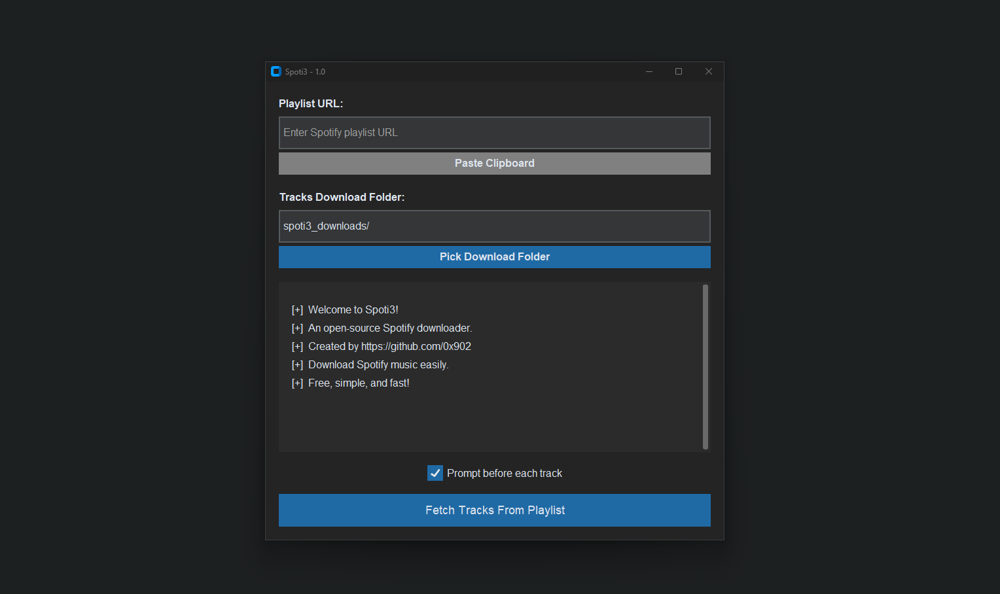

# Spoti3 - Spotify Playlist Downloader

**Spoti3** is an open-source Python application that allows you to easily download MP3s from your Spotify playlists. By integrating Spotify and YouTube APIs, it fetches playlist tracks, searches for YouTube videos, and downloads them as MP3 files. The app has a clean, user-friendly interface built with `CustomTkinter`.

---



---

## Features

-   **Spotify Playlist Integration**: Fetch tracks directly from your Spotify playlists by pasting the playlist URL.
-   **YouTube Search & Download**: Find corresponding YouTube videos for each track and download them as MP3 files.
-   **Download Folder Customization**: Choose a folder to save the MP3 files locally.
-   **Prompt Before Download**: Optionally prompt before downloading each track.
-   **User-Friendly UI**: Simple and intuitive interface with dark mode.

---

## Installation

Follow these steps to set up Spoti3 on your machine:

### 1. Clone the repository

Clone the repository using Git:

```bash
git clone https://github.com/0x902/Spoti3.git
```

### 2. Install dependencies

Navigate to the project folder and install the required Python packages:

```bash
cd spoti3
pip install -r requirements.txt
```

### 3. Run the app

After installing the dependencies, you can launch the app:

```bash
python ui.py
```

---

## Usage

1. **Fetch Tracks**: Enter the URL of a Spotify playlist and click "Fetch Tracks From Playlist" to load the tracks.
2. **Pick Folder**: Choose a folder where you want to save the downloaded MP3 files.
3. **Prompt Before Download**: Enable this option to control which tracks are downloaded.
4. **Download MP3s**: Click the "Download Tracks" button to start the download process.

The app will search YouTube for each track and download the audio as an MP3 file.

---

## Requirements

-   Python 3.x
-   `CustomTkinter` for the graphical user interface
-   `pyperclip` for clipboard management
-   `spotipy` for fetching track lists from Spotify playlists
-   `pytubefix` for downloading YouTube videos as MP3

Install the dependencies with:

```bash
pip install -r requirements.txt
```
